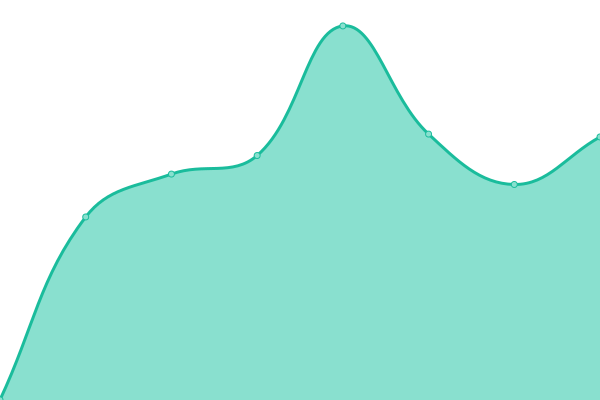
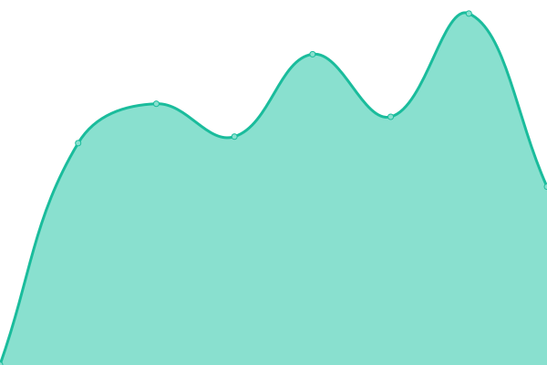
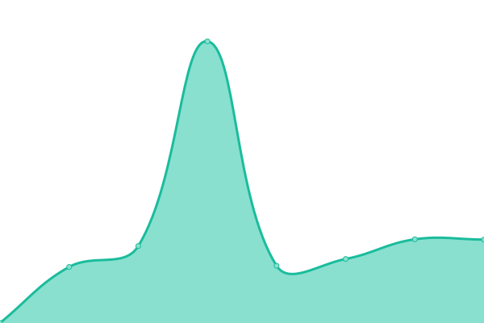
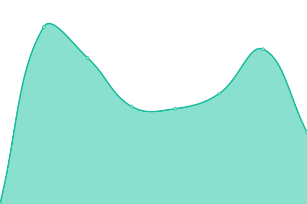
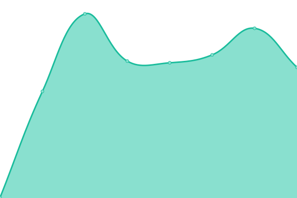

# [📈 Live Status](https://status.smart-moov.io): <!--live status--> **🟧 Partial outage**

This repository contains the open-source uptime monitor and status page for [SmartMoov](https://www.smart-moov.fr), powered by [Upptime](https://github.com/upptime/upptime).

With [Upptime](https://upptime.js.org), you can get your own unlimited and free uptime monitor and status page, powered entirely by a GitHub repository. We use [Issues](https://github.com/smart-moov/upptime/issues) as incident reports, [Actions](https://github.com/smart-moov/upptime/actions) as uptime monitors, and [Pages](https://status.smart-moov.io) for the status page.

<!--start: status pages-->
<!-- This summary is generated by Upptime (https://github.com/upptime/upptime) -->
<!-- Do not edit this manually, your changes will be overwritten -->
<!-- prettier-ignore -->
| URL | Status | History | Response Time | Uptime |
| --- | ------ | ------- | ------------- | ------ |
|  [Dashboard](https://app.smart-moov.io) | 🟥 Down | [dashboard.yml](https://github.com/smart-moov/upptime/commits/HEAD/history/dashboard.yml) | 

 1551ms
     
 | 

<a href="https://status.smart-moov.io/history/dashboard">99.85%</a>
    

|  [API](https://api.smart-moov.io/ping) | 🟩 Up | [api.yml](https://github.com/smart-moov/upptime/commits/HEAD/history/api.yml) | 

 900ms
     
 | 

<a href="https://status.smart-moov.io/history/api">100.00%</a>
    

|  [Campaign website](https://campaigns.smart-moov.io) | 🟩 Up | [campaign-website.yml](https://github.com/smart-moov/upptime/commits/HEAD/history/campaign-website.yml) | 

 1287ms
     
 | 

<a href="https://status.smart-moov.io/history/campaign-website">100.00%</a>
    

|  [Jobs website](https://jobs.smart-moov.io) | 🟩 Up | [jobs-website.yml](https://github.com/smart-moov/upptime/commits/HEAD/history/jobs-website.yml) | 

 1493ms
     
 | 

<a href="https://status.smart-moov.io/history/jobs-website">100.00%</a>
    

|  [Campaign API](https://chatbot.smart-moov.io/ping) | 🟩 Up | [campaign-api.yml](https://github.com/smart-moov/upptime/commits/HEAD/history/campaign-api.yml) | 

 843ms
     
 | 

<a href="https://status.smart-moov.io/history/campaign-api">100.00%</a>
    

|  [Code API](https://code.smart-moov.io/ping) | 🟩 Up | [code-api.yml](https://github.com/smart-moov/upptime/commits/HEAD/history/code-api.yml) | 

 805ms
     
 | 

<a href="https://status.smart-moov.io/history/code-api">100.00%</a>
    

|  [BeSTT API](https://bestt.smart-moov.io/ping) | 🟩 Up | [be-stt-api.yml](https://github.com/smart-moov/upptime/commits/HEAD/history/be-stt-api.yml) | 

 510ms
     
 | 

<a href="https://status.smart-moov.io/history/be-stt-api">100.00%</a>
    

<!--end: status pages-->

[**Visit our status website →**](https://status.smart-moov.io)

## 📄 License

- Powered by: [Upptime](https://github.com/upptime/upptime)
- Code: [MIT](./LICENSE) © [SmartMoov](https://www.smart-moov.fr)
- Data in the `./history` directory: [Open Database License](https://opendatacommons.org/licenses/odbl/1-0/)
